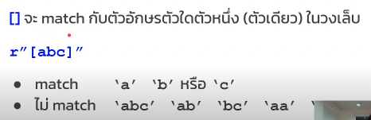
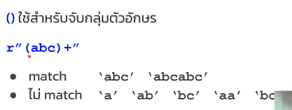
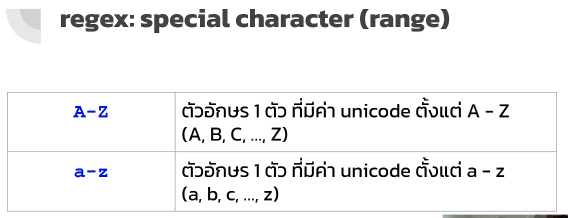

# RegX

-> เป็นภาษา/เครื่องมือ ที่ใช้จัดการข้อมูลที่เป็นตัวอักษร

## ใช้ทำอะไร

- ค้นหา substring ใน string
- แทนค่าใน string
- แบ่ง string ออกเป็นหลายๆส่วน

## ทำงานยังไง

- เขียนรูปแบบ string ที่เราต้องการหา/เปลี่ยน/แบ่ง ด้วย regx
- regx ที่เราเขียนจะไป match กับ string ว่าตรงกันหรือเปล่า

## Syntax

`Note : ` r"..." => regx

